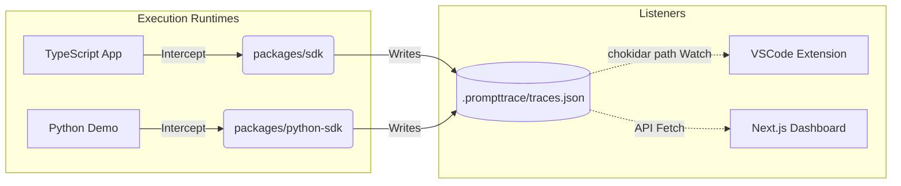
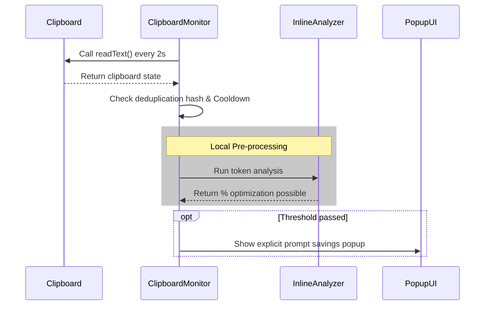

# Prompttrace System Architecture

Prompttrace functions on a simple, decoupled pub-sub architecture. All cross-language communication occurs using the local `.prompttrace/traces.json` file as an append-only event bus. 

There are no databases, web sockets, or background docker containers required.

## 1. Primary Execution Flow

When a generation event occurs, it follows a strict sequence:

```text
traceLLM()
 → wrapper.ts intercepts
 → tokenizer.ts (computes size)
 → insights.ts (computes savings)
 → storage.ts writes logic to disk
 → SDK writes → file change → chokidar triggers → extension reacts
```

## 2. High-Level Architecture Components

*   **SDK Handlers (TS/Python):** The proxy engines. They wrap framework API calls (e.g. OpenAI), calculate token usage, apply cost multipliers, and write the output file directly.
*   **Event Bus Layer (`traces.json`):** The isolated source-of-truth log. It is synchronously written. Specifically, modifying its timestamp via `utimesSync` forces external watchers to instantly recognize changes.
*   **VSCode Extension Monitor:** A background daemon looking at un-sent text. Modules like `clipboard-monitor.ts` and `prompt-detector.ts` read the OS clipboard and active documents. They use `inline-analyzer.ts` to surface token savings through IDE popups before any request goes out. 
*   **Next.js Visual Dashboard:** An offline read-only Dashboard serving complex data visualizations via safely fetching the local traces file. **Unlike the Extension which reacts instantly to file events utilizing `chokidar`, the Dashboard exclusively polls and fetches.**
*   **Refinement Sub-system:** Optional API integrations (e.g., calling Groq) to pass badly bloated text to an AI model to obtain optimized prompts.

## 3. Core Constraints

1.  **Zero-Network Telemetry:** Telemetry data stays 100% locally bounded. Data is not routed through any 3rd-party servers by default. External AI requests are strictly opt-in (`aiAnalysis: true`).
2.  **OS-Native IPC:** Instead of traditional Sockets or Node messaging streams, the system uses the File System. Hashing and writing to `.prompttrace` lets any language safely deposit events without locking up ports or needing background services. 
3.  **Fail-Fast Heuristics:** To avoid freezing your IDE and burning API calls, the Editor features use threshold checks. Context like plain `code-file` documents drop confidence scores instantly, while `clipboard` strings bypass checks only if token metrics exceed minimums.

---

## 4. Key Diagrams

### a) Process Propagation



### b) Editor Clipboard & NLP Routine

VSCode polls asynchronously to avoid blocking the main thread during typing.


