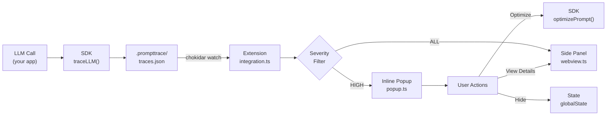
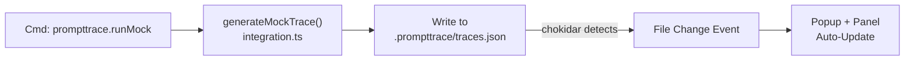
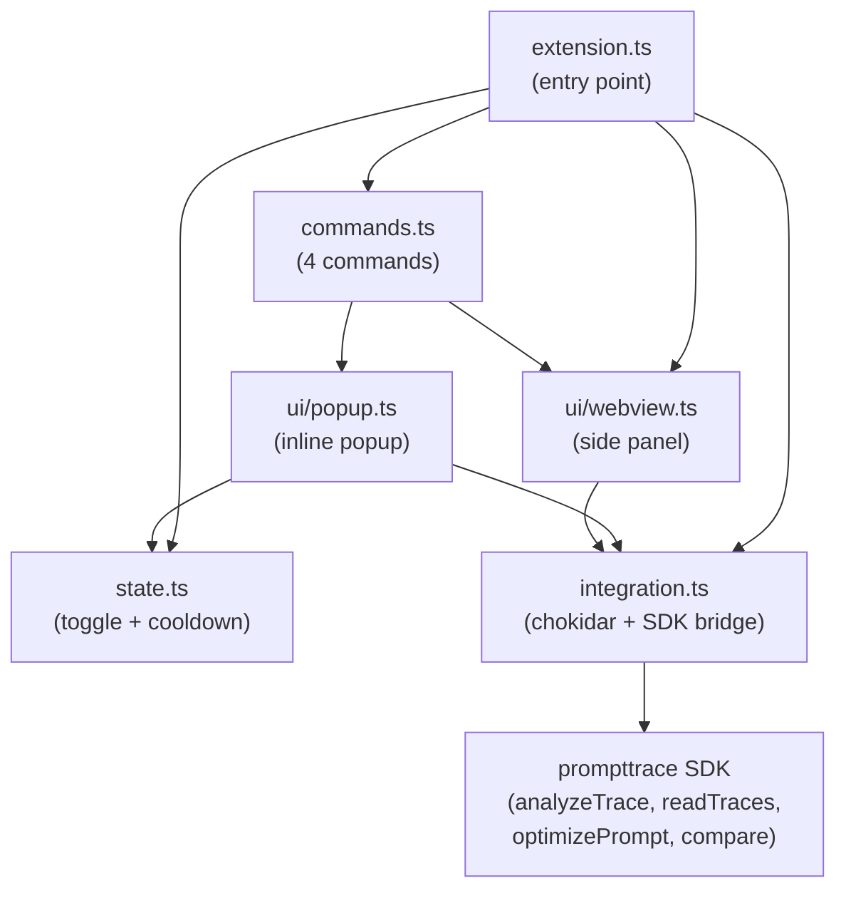

# Prompttrace — VSCode / Cursor Extension

> Real-time LLM cost optimization assistant inside your editor.

Prompttrace Extension watches your local `.prompttrace/traces.json` for new LLM traces, then instantly surfaces actionable cost insights, context bloat warnings, and simulated savings — all without leaving your editor.

It integrates directly with the existing [Prompttrace SDK](/packages/sdk) — zero reimplementation, zero external APIs, fully local.

---

## Features

- **Inline Popups** — Instant cost/token summary after every LLM call, filtered to show only high-severity insights
- **Side Panel Dashboard** — Aggregated cost view, per-trace breakdowns, impact simulations
- **Smart File Watching** — Uses `chokidar` with debounce to detect new traces automatically
- **Mock Mode** — Generate realistic test traces without API keys
- **Toggle Control** — Enable/disable via command palette or status bar click
- **Popup Cooldown** — 5-second debounce prevents notification spam during rapid development

---

## Architecture

### Data Flow



### Mock Mode Flow



### Extension Module Map



---

## Commands

| Command | Palette Title | Description |
|---------|--------------|-------------|
| `prompttrace.toggle` | Prompttrace: Toggle On/Off | Enable or disable the extension |
| `prompttrace.showPanel` | Prompttrace: Show Side Panel | Open the sidebar dashboard |
| `prompttrace.showLastTrace` | Prompttrace: Show Latest Trace | Display popup for the most recent trace |
| `prompttrace.runMock` | Prompttrace: Run Mock Trace | Generate a mock trace for testing |

---

## Insight Severity Levels

The extension classifies insights into three severity tiers:

| Level | Numeric | Popup Behavior | Panel Behavior |
|-------|---------|---------------|----------------|
| 🔴 **High** | ≥ 3 | Shown in popup | Red dot indicator |
| 🟡 **Medium** | 2 | Suppressed from popup | Yellow dot indicator |
| 🔵 **Low** | 1 | Suppressed from popup | Blue dot indicator |

Only **high severity** insights trigger inline popups to reduce noise during active development.

---

## Getting Started

### 1. Build the monorepo

```bash
cd /path/to/prompttrace
npm install
npm run build
```

### 2. Open in VSCode / Cursor

Open the monorepo root in your editor. The extension activates automatically on startup.

### 3. Try Mock Mode

Press `Cmd+Shift+P` (or `Ctrl+Shift+P`) and run:

```
Prompttrace: Run Mock Trace
```

This generates a realistic trace with a bloated system prompt and conversation history, writes it to `.prompttrace/traces.json`, and triggers both the inline popup and sidebar update.

### 4. Use with Real SDK

In your application code:

```typescript
import OpenAI from 'openai';
import { traceLLM } from 'prompttrace';

const client = traceLLM(new OpenAI({ apiKey: '...' }), {
  log: true,
  store: 'local'
});

await client.chat.completions.create({
  model: 'gpt-4o-mini',
  messages: [...]
});
// Extension auto-detects the new trace and shows popup
```

---

## Development

```bash
# Watch mode (rebuilds on file changes)
cd apps/extension
npm run watch

# Then press F5 in VSCode to launch Extension Development Host
```

---

## Privacy

- ✅ All data stays in `.prompttrace/` on your local machine
- ✅ Zero external API calls from the extension
- ✅ No telemetry, no tracking, no cloud
